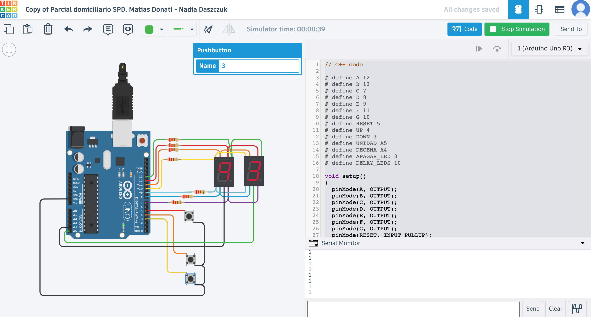

## Proyecto:
 - Contador de dos cifras con dos Display de 7 segmentos.
 - Swtich para mostrar contador de numeros primos.
 - Adicion de Motor, sensor de temperatura y fotoresistor.

## Integrantes
- Nadia Daszczuk
- Matias Donati

## Descripción
El programa esta desarrolado en lengia C++ mediante la web https://www.tinkercad.com/

En esta primera parte del parcial domiciliario realizamos mediante el uso de la multiplexación, un contador de 00 al 99, con dos displays de 7 segmentos.

El contador cuenta con tres botones, uno para subir, otro para bajar y el tercero para volver a cero.
Luego adicionamos un Switch el cual, dependiendo de su posición, deja el peoyecto funcionando como previamente estaba, o en los displays solo se muestra un contador de numeros primos del 00 al 99, se puede subir y bajar al numero primo mas próximo o bien ir a 0 con el boton de Reset.

Tambien mediante la funcion map obtuvimos el rango correcto de temperatuda de un sensor de temperatura e incorporamos un motor y un fotoresistor.
El arranque del motor depende del sensor de temperatura que a su vez depende de los valores del fotoresistor.
 - Ej: si el fotoresistor es mayor a 940 la temperatura se setea en 35 por lo que se enciende el motor. (El motor se encuendo cuando la teperatura igual o mayor a 30, caso contrario se apaga.)

## Funciónes principales
 - imprimir_contador(int contador)

 Esta funcion es la que se encarga de alternar la visualización de cada display en un intervalo de tiempo muy corto,  para que parezca que ambos están encendidos al mismo tiempo.

 - int keypressed(void)

 Esta funcion lee los estados de los botones. Se manjea en base a dos valores: el boton principal 0 o 1, y un valor para saber si el boton ya se presionó.
 - Ej: Como el programa loopea de forma rapida, cuando se ejecuta el boton no esta presionado, por lo que la variable q define si se presiono toma su valor en 1. Cuando el boton se presiona (0) se verifica si est distnto del valor presionado(1) en ese momento se confirma que el boton fue presionado se iguala el valor del boton con el valor de boton presionado previamente se retorna dicho boton.
 La igualacion de valores se realiza para que si el boton queda presionado no se tome como suba de contador.

- bool es_primo(int numero)
Como su nombre indica, luego de realizar un calculo con el modulo %, retorna un booleano para saber si el numero es primo.

## :robot: Link al proyecto
- [proyecto](https://www.tinkercad.com/things/hhzmKLDNCTP-copy-of-para-nadia/editel?tenant=circuits)

## :tv: Link al video del proceso
- [video](https://www.youtube.com/watch?v=VyGjE8kx-O0)

---
### Fuentes
- [Consejos para documentar](https://www.sohamkamani.com/how-to-write-good-documentation/#architecture-documentation).

- [Lenguaje Markdown](https://markdown.es/sintaxis-markdown/#linkauto).

- [Markdown Cheatsheet](https://github.com/adam-p/markdown-here/wiki/Markdown-Cheatsheet).

- [Tutorial](https://www.youtube.com/watch?v=oxaH9CFpeEE).

- [Emojis](https://gist.github.com/rxaviers/7360908).

---

## :thumbsup: :thumbsup:
## :heart: :heart:
## :star: :star:
## :fire: :fire:
## :rocket: :rocket:
## :tada: :tada:
## :sunny: :sunny:
## :wink: :wink:
## :coffee: :coffee:

